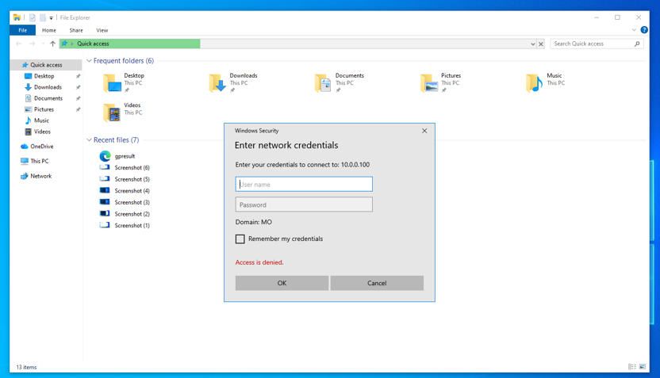
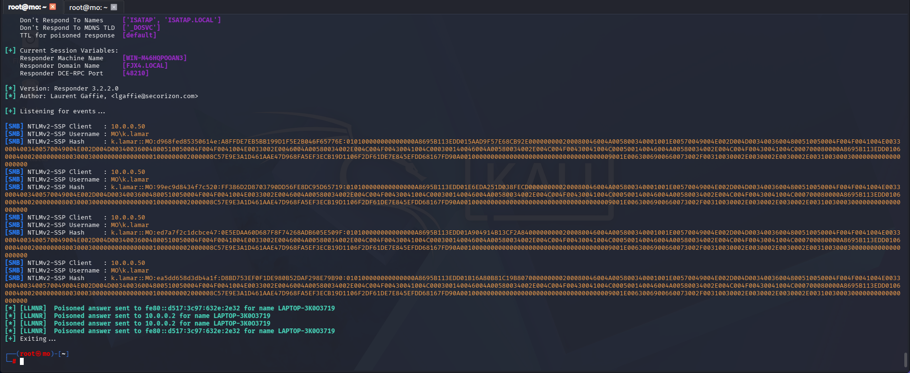
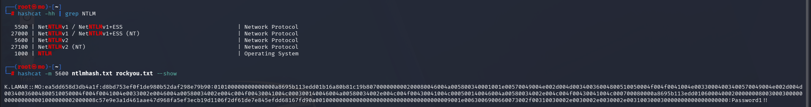

# LLMNR Poisoning

## What is LLMNR?

**Link-Local Multicast Name Resolution (LLMNR)** is a fallback name resolution protocol used when DNS fails to identify a host. When a machine can't resolve a hostname via DNS, it broadcasts an LLMNR request to the local network asking _"Does anyone know where this host is?"_

An attacker can exploit this by listening for those broadcasts and responding with their own IP address — tricking the victim into sending their NTLMv2 credentials directly to the attacker. This is known as LLMNR poisoning.

### Attack Flow

```
Victim DNS fails → Broadcasts LLMNR request → Attacker responds with own IP → Victim sends NTLMv2 hash
```

---

## Step 1 — Run Responder

[Responder](https://github.com/lgandx/Responder) listens on the network and answers LLMNR/NBT-NS broadcasts, poisoning the response to capture hashes.

```bash
responder -I eth0 -dwv
```

| Flag      | Description                                       |
| --------- | ------------------------------------------------- |
| `-I eth0` | Network interface to listen on (use capital `-I`) |
| `-d`      | Enable DHCP rogue server responses                |
| `-w`      | Start the WPAD rogue proxy server                 |
| `-v`      | Verbose mode — detailed log output                |


---

## Step 2 — Wait for an Event

A victim on the network attempts to access a resource that doesn't exist — a typo, misconfigured path, or stale mapped drive. DNS fails, an LLMNR broadcast goes out, and Responder intercepts and poisons it.



---

## Step 3 — Capture the Hash

Responder prints the full NTLMv2 hash to the terminal as soon as the event occurs. Copy the entire hash string into a text file for cracking.



```bash
# Copy the hash from Responder output and save it
echo "<paste full hash here>" > ntlmhash.txt
```

When a poisoned LLMNR response is sent, the victim machine sends its NTLMv2 credentials to the attacker. Responder captures:

| Captured Data        | Example           |
| -------------------- | ----------------- |
| Victim IP address    | `10.0.0.50`       |
| Domain & username    | `MO\k.lamar`      |
| NTLMv2 password hash | `k.lamar::MO:...` |

---

## Step 4 — Crack the Hash

Use [Hashcat](https://hashcat.net/hashcat/) to run the captured hash against a wordlist offline.

```bash
hashcat -m 5600 ntlmhash.txt rockyou.txt
```

| Flag / Argument | Description                       |
| --------------- | --------------------------------- |
| `-m 5600`       | Hash type: NTLMv2                 |
| `ntlmhash.txt`  | File containing the captured hash |
| `rockyou.txt`   | Wordlist to crack against         |



If the password exists in the wordlist, Hashcat recovers it in plaintext. In this example, the cracked password was `Password1!!`.

After a successful crack, the attacker has:

| Data               | Value         |
| ------------------ | ------------- |
| Target IP          | `10.0.0.50`   |
| Domain             | `MO`          |
| Username           | `k.lamar`     |
| Plaintext password | `Password1!!` |

With valid domain credentials, an attacker can move laterally, access shares, or escalate privileges depending on the account's permissions.

---

## Mitigation

| Action                   | How                                                                                                                        |
| ------------------------ | -------------------------------------------------------------------------------------------------------------------------- |
| Disable LLMNR            | Group Policy → Computer Config → Admin Templates → Network → DNS Client → **Turn off multicast name resolution** → Enabled |
| Disable NBT-NS           | Network adapter properties → IPv4 → Advanced → WINS tab → **Disable NetBIOS over TCP/IP**                                  |
| Enforce strong passwords | Long, complex passwords make offline cracking infeasible even with the hash                                                |
| Enable SMB Signing       | Prevents relaying captured hashes to other machines                                                                        |
| Network segmentation     | Limits the blast radius if an attacker does get on the network                                                             |

> **Note:** If your environment requires LLMNR or NBT-NS, consider implementing Network Access Control (NAC) and monitoring for anomalous LLMNR responses as a compensating control.
