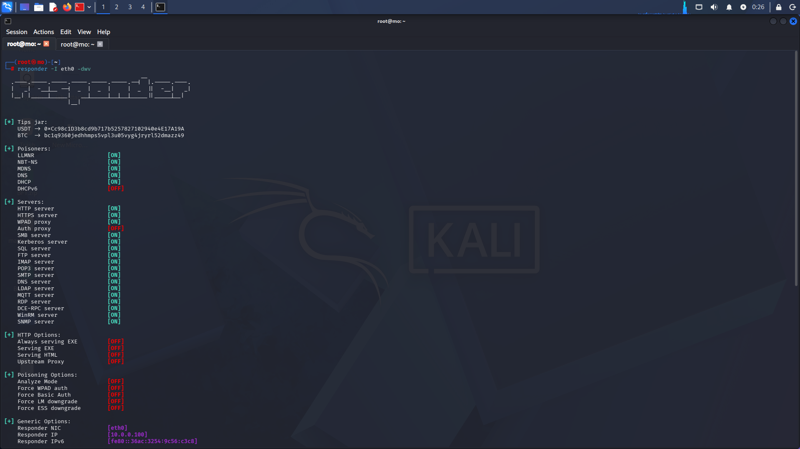

# LLMNR Poisoning

What is LLMNR? Link-Local Multicast Name Resolution (LLMNR) is a fallback name resolution protocol used when DNS fails. An attacker can respond to these broadcasts and capture NTLMv2 hashes.
LLMNR poisoning is an attack where a malicious actor listens for LLMNR requests and responds with their own IP address (or another IP of their choosing) to redirect the traffic. This can lead to credential theft and relay attacks in Active Directory. Here is a sample walkthrough.used to identify hosts when DNS fails to do so

### Attack Flow

```markdown
Victim's DNS fails → Broadcasts LLMNR request → Attacker responds → Victim sends NTLMv2 hash
```

## Step 1 Run Responder

```markdown
responder -I eth0 -dwv
```



What the current flags mean:
-I eth0: Specifies the network interface (eth0). (Note: Ensure you use a capital -I, as lowercase -i is typically reserved for IP redirection or macOS specific routing).
-d: Enables DHCP rogue server responses.
-w: Starts the WPAD rogue proxy server.
-v: Enables verbose mode to display detailed log outputs.

## Step 2 Wait for an event

A victim on the network attempts to access a resource that doesn't exist (typo, misconfigured path, etc.). DNS fails, LLMNR broadcast is sent, and Responder intercepts it.


When a LLMNR event occurs in the network and is maliciously responded to, the attacker will obtain sensitive information, including:

The IP address of the victim (in this example: 10.0.3.7)
The domain and username of the victim (in this example: MARVEL\fcastle)
The victim’s password hash
With the victim’s hash in hand, we can attempt to take the hash offline and crack it.

## Step 3 Capture the Hash

Responder displays captured NTLMv2 hashes in the terminal. Copy the full hash into a file:

- Hashes show up on our responder including the host
  
- copy into a textfile name it ntlmhash.txt

## Step 4 Crack the Hash

We can now use a password cracking tool, such as Hashcat, to attempt to crack the victim’s hash.

```
hashcat -m 5600 ntlmhash.txt rockyou.txt
```


What the current flags mean:
-m 5600: Hash type: NTLMv2
ntlmhash.txt: File containing captured hash
rockyou.txt: Wordlist

We have successfully cracked the victim’s password hash, which was found to be “Password1!!“.

Target IP Address: The network location of the specific victim machine that sent the request.
Domain: The Active Directory domain name the user belongs to.
Username: The specific user account name
Plaintext Password: The actual, readable password once cracked with hash.

With these combined elements, we can

## Mitigation
