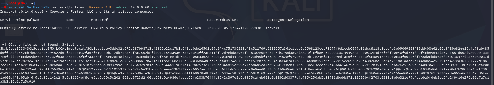

# Kerberoasting

Kerberoasting is a post-compromise adversary technique where an attacker requests a Kerberos Ticket Granting Service (TGS) ticket for any service account associated with a Service Principal Name (SPN). Because a portion of the TGS ticket is encrypted using the service account's password hash, the attacker can extract the hash from memory and attempt to crack it offline to uncover the plaintext credentials.


## Phase 1: Internal Reconnaissance & DC Discovery

Before initiating the Kerberoasting attack, we must locate the Domain Controller infrastructure within the subnet. In an internal assessment, this can be achieved via active network sweeps or passive DNS queries.

### Method A: Network Enumeration via Nmap

We run a targeted port scan across the local `/24` subnet looking specifically for active Kerberos (Port 88) and LDAP (Port 389) services, which are unique to Domain Controllers.

```bash
nmap -p 88,389,445 --open 10.0.0.0/24
```


- **Result:** The scan revealed `10.0.0.60` with both ports open, confirming it as the Active Directory Domain Controller. Host

After a successful credential capture and crack, the attacker has everything needed to authenticate to the target:

| Data               | Value         |
| ------------------ | ------------- |
| Target IP          | `10.0.0.50`   |
| Domain             | `MO`          |
| Username           | `k.lamar`     |
| Plaintext password | `Password1!!` |

## Step 1: Enumerate SPNs

We use the Impacket suite to query the Domain Controller for accounts tied to a Service Principal Name (SPN) and request their Ticket Granting Service (TGS) tickets.

```bash
impacket-GetUserSPNs mo.local/k.lamar:'Password1!!' -dc-ip 10.0.0.60 -request
```



The query returned a service account named **SQLService**, along with its corresponding `$krb5tgs$` hash.

## Step 2: Cracking Hash using Hashcat

With the TGS ticket extracted, we can attempt to crack the service account's password offline using Hashcat (Mode 13100) and the

```bash
hashcat -m 13100 hashes.txt rockyou.txt -O
```


The offline attack completed successfully, revealing the plaintext password for the **SQLService** account.
